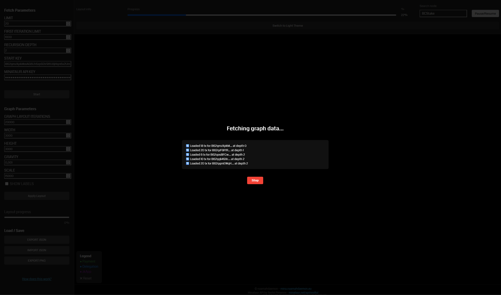
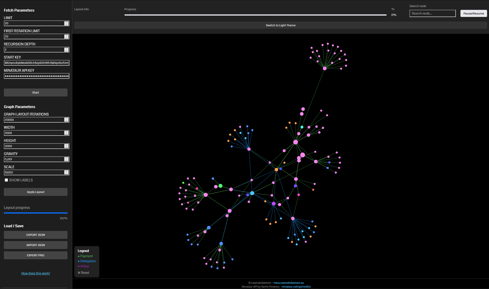
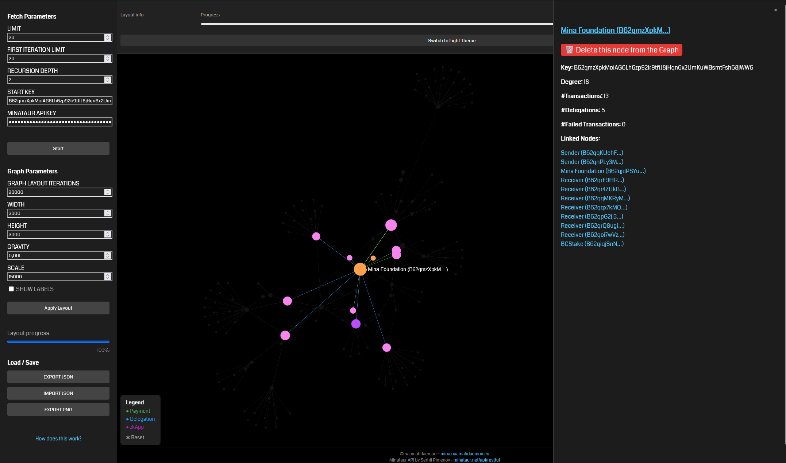
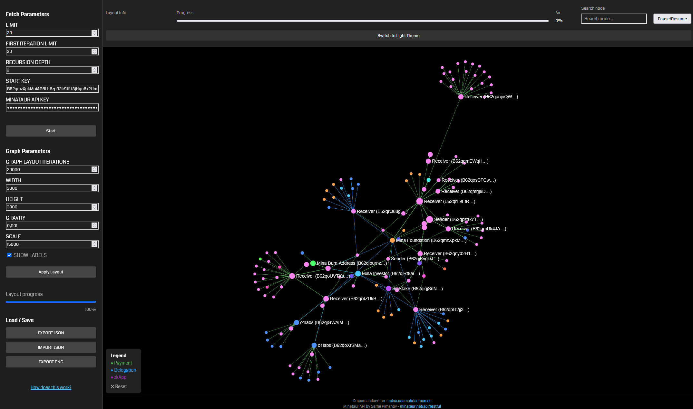
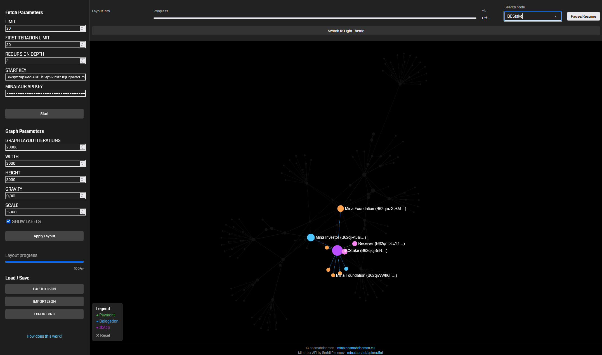
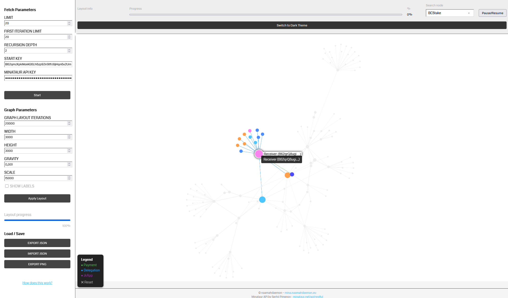
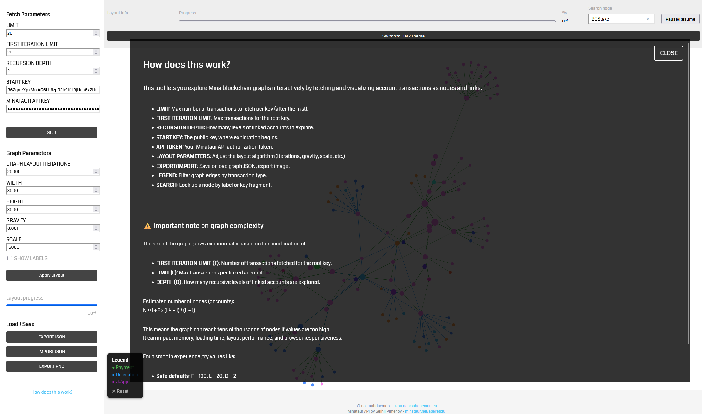

# Mina Graph Explorer

**Mina Graph Explorer** is a fully client-side web tool to visualize and explore graphs built from [Mina Protocol](https://minaprotocol.com) blockchain transactions. It uses data from the [Minataur API](https://minataur.net) and renders it dynamically using [Sigma.js](https://github.com/jacomyal/sigma.js) and [Graphology](https://graphology.github.io/).

---

## 🌐 Live Demo

You can try the tool here:  
👉 [mina.naamahdaemon.eu/mina-graph](https://mina.naamahdaemon.eu/mina-graph)

---

## 🔍 What Does It Do?

Mina Graph Explorer allows you to:

- Start from a public key and recursively fetch its transaction graph
- Explore nodes (accounts) and edges (transactions) visually
- Filter by transaction type (payment, delegation, zkApp)
- Search nodes by name or public key fragment
- Customize layout parameters for graph positioning
- Save and load graphs as JSON
- Export visualizations as PNG images

### Layout execution

Layouts run in a Web Worker managed by a single controller. Starting a new layout
cancels the previous run, stale worker messages are ignored, and graph mutations
cannot re-apply positions to deleted nodes. Large graphs automatically use a lower
iteration limit because the bundled force-directed algorithms have quadratic
repulsion costs.

The automatic layout uses a size-aware iteration budget: small initial graphs get
more time to settle, while incremental updates and node drags use shorter passes.
The manual layout remains controlled by the iteration field in the sidebar.

The `OpenOrd-inspired` option is experimental: it is a cooled force-directed
layout, not a complete implementation of the OpenOrd paper.

Worker regression tests can be run with:

```sh
node tests/layout-workers.test.js
```

---

## ⚙️ How It Works

1. **Start Key**: You provide a Mina public key (starting point).
2. **Depth**: The tool will recursively follow transactions and build a graph up to the specified number of levels.
3. **Limit** and **First Iteration Limit**: Control the number of transactions fetched per key (initial vs. subsequent).
4. Graph nodes represent public keys (with optional names), and edges represent transactions.
5. The layout is calculated using a force-directed layout algorithm in the browser.

---

## 🧠 Important Note on Graph Complexity

The number of nodes and edges can grow **exponentially** with:

- `DEPTH` (recursion level),
- `LIMIT` (transactions fetched per key), and
- `FIRST ITERATION LIMIT` (transactions for the root key).

For example:

```
DEPTH = 2, LIMIT = 80 → up to 1 + 80 + 80×80 = 6481 nodes (in the worst case).
```

To avoid freezing the browser or API throttling, start with small values and increase gradually.

---

## 🪪 Prerequisites

You need a **Minataur API key** to fetch blockchain data.

### Run locally

Web Workers and service workers cannot reliably be loaded from a `file://` URL.
Start the dependency-free development server from the project directory instead:

```sh
npm run dev
```

Then open [http://127.0.0.1:8765](http://127.0.0.1:8765). Stop the server with
`Ctrl+C`. A different port can be selected with the `MINAGRAPH_PORT` environment
variable.

### 🔑 How to Get a Minataur API Key

1. Go to: [https://minataur.net/api/restful](https://minataur.net/api/restful)
2. Create an account and generate a personal API token.
3. Your token should look like this:

`minataur-token:<username>:<uuid>`

4. Paste it into the "Minataur API Key" input field in the web app.

---

## 🛠️ Technologies Used

- 🕸️ Vanilla HTML, CSS, and JS (no build step!)
- 📈 [Sigma.js 2.x](https://github.com/jacomyal/sigma.js) — graph rendering
- 🔗 [Graphology](https://graphology.github.io) — graph data structure
- 🌐 Minataur API — blockchain data backend

---

## 📦 Project Structure

> index.html → Main interface and logic layoutWorker.js → Optional layout thread (Web Worker) 
> graph.json → Example exported graph (optional)


---

## 🖼️ Screenshots









---

## 🤝 Contributions

This project is open to feedback, improvements, or ideas — feel free to fork or submit pull requests.

---

## 📄 License

MIT — free to use, modify, and redistribute.

---

## 👤 Author

**Naamah Daemon**  
[mina.naamahdaemon.eu](https://mina.naamahdaemon.eu)
